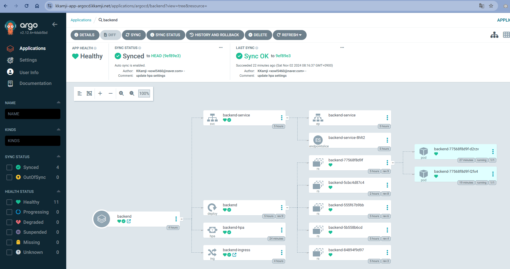

# KKamJi-Infra

Terraform을 통한 AWS Infra 프로비저닝

## AWS Infra Architecture

- [AWS Architecture](architecture/architecture.webp)

## 구축 완료 보고

- [x] S3, DynamoDB 백엔드 구성
- [x] ECR 생성
- [x] vpc 생성
- [x] EKS 생성
- [x] AWS Load Balancer Controller 배포
- [x] VPC CNI 접두사 할당
- [x] EKS Metrics Server 배포
- [x] EKS에 database, application 배포
- [x] karpenter 구성
- [x] Secrets Manager에 API 서버 환경변수 추가
- [x] Route53 LB 연동
- [x] LB TLS 인증
- [x] HPA 구성
- [x] ArgoCD 구성
- [x] Helm Chart 구성
- [x] WAF 구성
- [x] Monitoring -> CloudWatch Container Insight

## Helm Chart - helm-kkamji-app

```bash
cd helm-kkamji-app

helm install kkamji-app . -n helm-managed-kkamji-app --create-namespace \
  --set mysql.auth.username={user_name} \
  --set mysql.auth.password={user_password} \
  --set mysql.auth.database={database_name} \
  --set mysql.storage.storageClass={storageclass_name}

## mysql.storage.storageClass를 미지정 했을시 gp3라는 이름의 storage class가 존재해야함

❯ helm list -A
hNAME                           NAMESPACE                       REVISION        UPDATED                                 STATUS          CHART                                   APP VERSION
aws-load-balancer-controller    kube-system                     1               2024-11-02 02:47:53.310076158 +0900 KST deployed        aws-load-balancer-controller-1.9.2      v2.9.2     
karpenter                       karpenter                       1               2024-11-02 03:03:15.926017767 +0900 KST deployed        karpenter-1.0.7                         1.0.7      
kkamji-app                      helm-managed-kkamji-app         1               2024-11-02 05:10:48.26394829 +0900 KST  deployed        kkamji-app-0.1.0                        1.16.0     
```

## ArgoCD **구성**

### API-Server



### ArgoCD


## Monitoring

EKS Add-on Amazon CloudWatch Observability 사용
전체, 노드, 네임스페이스, 서비스 각각의 리소스 지표 모니터링 가능

### Node별 리소스 확인


### Namespace별 리소스 확인


## WAF


## 부하테스트 - karpenter 노드 프로비저닝 확인

### 로드 전

```bash
❯ k get nodes
NAME                                               STATUS   ROLES    AGE     VERSION
ip-10-10-210-62.ap-northeast-2.compute.internal    Ready    <none>   5h12m   v1.31.0-eks-a737599
ip-10-10-220-15.ap-northeast-2.compute.internal    Ready    <none>   7m26s   v1.31.0-eks-a737599
❯ k top nodes
NAME                                               CPU(cores)   CPU%   MEMORY(bytes)   MEMORY%   
ip-10-10-210-62.ap-northeast-2.compute.internal    1542m        79%    2043Mi          62%       
ip-10-10-220-15.ap-northeast-2.compute.internal    1346m        69%    2109Mi          64% 
```

### 로드 후

```bash
❯ k get nodes
NAME                                               STATUS   ROLES    AGE     VERSION
ip-10-10-210-100.ap-northeast-2.compute.internal   Ready    <none>   5m12s   v1.31.0-eks-a737599
ip-10-10-210-62.ap-northeast-2.compute.internal    Ready    <none>   5h20m   v1.31.0-eks-a737599
ip-10-10-220-15.ap-northeast-2.compute.internal    Ready    <none>   15m     v1.31.0-eks-a737599

❯ k top nodes
NAME                                               CPU(cores)   CPU%   MEMORY(bytes)   MEMORY%   
ip-10-10-210-100.ap-northeast-2.compute.internal   325m         16%    909Mi           27%       
ip-10-10-210-62.ap-northeast-2.compute.internal    1821m        94%    1558Mi          47%       
ip-10-10-220-15.ap-northeast-2.compute.internal    1930m        100%   2616Mi          79% 
```

### 시나리오

> 1. busybox 이미지에서 wget을 사용해 부하 발생
> 2. 부하로 인해 backend-hpa가 pod의 수를 증가시킴  
> 3. resource limit으로 인해 pod가 pending 상태에 빠짐  
> 4. Karpenter가 부족한 리소스, pod 개수 계산  
> 5. NodeClaim으로 node provisioning  

```bash
apiVersion: apps/v1
kind: Deployment
metadata:
  name: load-generator
  namespace: backend
spec:
  replicas: 10
  selector:
    matchLabels:
      app: load-generator
  template:
    metadata:
      labels:
        app: load-generator
    spec:
      containers:
      - name: load-generator-container
        image: busybox:1.28
        command: ["/bin/sh", "-c", "while true; do wget -q -O- http://backend-service.backend.svc.cluster.local:8787/docs & sleep 0.01; done"]
```

### Karpenter log

```bash
k logs -n karpenter {karpenter-pod-name} -f
~~~
~~~
~~~
{"level":"INFO","time":"2024-11-01T23:20:17.787Z","logger":"controller","message":"created nodeclaim","commit":"901a5dc","controller":"provisioner","namespace":"","name":"","reconcileID":"592dacdc-b137-4e25-840d-4aad57f99988","NodePool":{"name":"default"},"NodeClaim":{"name":"default-n6j4c"},"requests":{"cpu":"730m","memory":"1297Mi","pods":"8"},"instance-types":"t4g.medium"}
{"level":"INFO","time":"2024-11-01T23:20:20.602Z","logger":"controller","message":"launched nodeclaim","commit":"901a5dc","controller":"nodeclaim.lifecycle","controllerGroup":"karpenter.sh","controllerKind":"NodeClaim","NodeClaim":{"name":"default-n6j4c"},"namespace":"","name":"default-n6j4c","reconcileID":"3d55977e-ad31-45b5-998e-563702271e81","provider-id":"aws:///ap-northeast-2b/i-0e3dc8574c03b08a5","instance-type":"t4g.medium","zone":"ap-northeast-2b","capacity-type":"on-demand","allocatable":{"cpu":"1930m","ephemeral-storage":"17Gi","memory":"3187Mi","pods":"110"}}
{"level":"INFO","time":"2024-11-01T23:20:47.530Z","logger":"controller","message":"registered nodeclaim","commit":"901a5dc","controller":"nodeclaim.lifecycle","controllerGroup":"karpenter.sh","controllerKind":"NodeClaim","NodeClaim":{"name":"default-n6j4c"},"namespace":"","name":"default-n6j4c","reconcileID":"b32294f7-4c9b-4c8e-a11f-7118b6419d66","provider-id":"aws:///ap-northeast-2b/i-0e3dc8574c03b08a5","Node":{"name":"ip-10-10-210-100.ap-northeast-2.compute.internal"}}
{"level":"INFO","time":"2024-11-01T23:21:08.861Z","logger":"controller","message":"initialized nodeclaim","commit":"901a5dc","controller":"nodeclaim.lifecycle","controllerGroup":"karpenter.sh","controllerKind":"NodeClaim","NodeClaim":{"name":"default-n6j4c"},"namespace":"","name":"default-n6j4c","reconcileID":"3e57cf1c-7183-4694-b06f-483ff35a7e41","provider-id":"aws:///ap-northeast-2b/i-0e3dc8574c03b08a5","Node":{"name":"ip-10-10-210-100.ap-northeast-2.compute.internal"},"allocatable":{"cpu":"1930m","ephemeral-storage":"18182813665","hugepages-1Gi":"0","hugepages-2Mi":"0","hugepages-32Mi":"0","hugepages-64Ki":"0","memory":"3373212Ki","pods":"110"}}
```

## Secrets 관리


## 파일 디렉토리 구조

```bash
❯ tree
.
├── README.md
├── architecture
│   └── architecture.webp
├── helm-kkamji-app
│   ├── Chart.yaml
│   ├── charts
│   ├── templates
│   │   ├── _helpers.tpl
│   │   ├── helm-backend-deployment.yaml
│   │   ├── helm-backend-hpa.yaml
│   │   ├── helm-backend-secret.yaml
│   │   ├── helm-backend-service.yaml
│   │   ├── helm-mysql-configmap.yaml
│   │   ├── helm-mysql-initdb-configmap.yaml
│   │   ├── helm-mysql-pvc.yaml
│   │   ├── helm-mysql-secret.yaml
│   │   ├── helm-mysql-service.yaml
│   │   └── helm-mysql-statefulset.yaml
│   └── values.yaml
├── kubernetes
│   ├── argocd
│   │   └── argocd-ingress.yaml
│   ├── backend
│   │   ├── backend-deployment.yaml
│   │   ├── backend-hpa.yaml
│   │   ├── backend-ingress.yaml
│   │   └── backend-service.yaml
│   ├── database
│   │   ├── mysql-config-configmap.yaml
│   │   ├── mysql-initdb-configmap.yaml
│   │   ├── mysql-pvc.yaml
│   │   ├── mysql-secret.yaml
│   │   ├── mysql-statefulset.yaml
│   │   └── mysql-svc.yaml
│   ├── karpenter
│   │   ├── controller-policy.json
│   │   ├── controller-trust-policy.json
│   │   ├── iam_policy.json
│   │   ├── node-pool.yaml
│   │   └── node-trust-policy.json
│   ├── storage_class
│   │   └── gp3-storage_class.yaml
│   └── test
│       ├── al2.yaml
│       ├── karpenter.yaml
│       └── test-pod.yaml
├── terraform
│   ├── main.tf
│   ├── modules
│   │   ├── ecr
│   │   │   ├── main.tf
│   │   │   ├── outputs.tf
│   │   │   └── variables.tf
│   │   ├── eks
│   │   │   ├── main.tf
│   │   │   ├── outputs.tf
│   │   │   └── variables.tf
│   │   ├── iam_policy
│   │   │   ├── main.tf
│   │   │   ├── outputs.tf
│   │   │   └── variables.tf
│   │   ├── iam_role
│   │   │   ├── main.tf
│   │   │   ├── outputs.tf
│   │   │   └── variables.tf
│   │   ├── vpc
│   │   │   ├── main.tf
│   │   │   ├── outputs.tf
│   │   │   └── variables.tf
│   │   └── waf
│   │       ├── main.tf
│   │       ├── outputs.tf
│   │       └── variables.tf
│   ├── outputs.tf
│   ├── prod
│   │   ├── main.tf
│   │   ├── outputs.tf
│   │   └── variables.tf
│   ├── templates
│   │   ├── backend_pod_policy.json
│   │   ├── controller-policy.json
│   │   ├── controller-trust-policy.json
│   │   ├── lb_controller_policy.json
│   │   ├── node-trust-policy.json
│   │   └── user_data.sh
│   ├── terraform.tfstate
│   └── versions.tf
```
